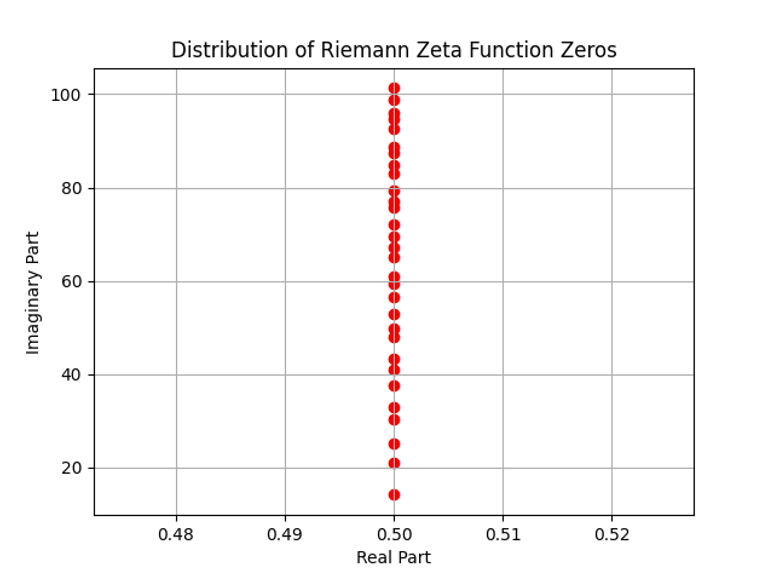

# CS 596 project Parallel Computation and Visualization of the Riemann Zeta function

This repository contains an MPI program written in C, explorations of Zeta zeros, and related visualizations in Python. This project is for CSCI 596 course.

## Project Overview

This project uses parallel computing to explore the properties and visualizations associated with Riemann Zeta functions. The first step is to write an MPI program in C for computing Riemann Zeta sums and related performance using MPI communication functions. The second step is to visualize the Riemann functions using Python+OpenGL. The third step is to generate the corresponding zeta zeros and explore their properties using Python.

## Repository Structure

- `src`
  - `ZetaSum.c`: MPI program for batch calculating Riemann zeta sums and checking the results against the error to measure performance.
  - `ZetaSum.sl`: Scripts for processing `ZetaSum.c`, which can be handled by the user according to needs.
  - `ZetaVisualization.py`: Using OpenGL to visualize Riemann functions in the complex plane.
  - `ZetaZeros.py`: Compute and visualize the first `N` zeros of the Riemann Zeta function.
  
- `results`
  - `ZetaSum.out`: Output of `ZetaSum.c` by runinng on CARC USC.
  - `RZzeros.txt`: A file for storing the first 1000 Riemann nontrivial zeros.
  - `ZetaZeros30.png`: Distribution of the first 30 nontrivial zeros of the Riemann Zeta function.
  - `ZetaZeros1000.png`: Distribution of the first 1000 nontrivial zeros of the Riemann Zeta function.

## Riemann Zeta function

### Introduction

The Riemann Zeta Function, typically denoted by the Greek letter `ζ` (Zeta), is a special function defined on the complex plane. It was introduced by the German mathematician Bernhard Riemann in 1859 and has been extensively studied, spanning various fields such as mathematics, physics, and engineering. A famous conjecture related to the Riemann Zeta Function is the Riemann Hypothesis. It posits that the non-trivial zeros of the function (those not corresponding to negative integers) lie on the critical line in the complex plane with the real part equal to $\frac{1}{2}\$. Despite extensive attention, this hypothesis remains unproven. 

The Riemann Zeta function plays a crucial role in mathematics, particularly in connection with number theory and complex analysis, exerting a profound influence on topics such as prime number distribution. In the realm of physics, it appears in quantum field theory and statistical physics, serving as a key tool for studying issues like energy level distribution and regularization.

### Analytic Form on the Complex Plane

The analytic form of the Riemann Zeta Function on the complex plane is defined as follows:

$\zeta(s) = 1^s + 2^{-s} + 3^{-s} + 4^{-s} + \ldots$

where `s` is a complex number. Specifically, if $s = a + bi$, then

$\zeta(s) = 1^s + 2^{-s} + 3^{-s} + 4^{-s} + \ldots$

In certain regions, this series converges, providing the definition of the Riemann Zeta Function in that region.

## Zeta Zeros

### Riemann–Siegel Formula

In mathematics, the Riemann-Siegel formula is an asymptotic formula for the error in the approximation of the Riemann zeta function. The formula approximates the values of the zeta function through the sum of two finite Dirichlet series. 

If `M` and `N` are non-negative integers, then the `ζ` is equal to

$$
\zeta(s)=\sum_{n=1}^N \frac{1}{n^s}+\gamma(1-s) \sum_{n=1}^M \frac{1}{n^{1-s}}+R(s)
$$

where

$$
\gamma(s)=\pi^{\frac{1}{2}-s} \frac{\Gamma\left(\frac{s}{2}\right)}{\Gamma\left(\frac{1}{2}(1-s)\right)}
$$

is the factor appearing in the functional equation

$$
\zeta(s)=\gamma(1-s) \zeta(1-s)
$$

and

$$
R(s)=\frac{-\Gamma(1-s)}{2 \pi i} \int \frac{(-x)^{s-1} e^{-N x}}{e^x-1} d x
$$

### Riemann–von Mangoldt Formula

The formula states that the number `N(T)` of zeros of the zeta function with imaginary part greater than 0 and less than or equal to `T` satisfies

$$
N(T)=\frac{T}{2 \pi} \log \frac{T}{2 \pi}-\frac{T}{2 \pi}+O(\log T)
$$

The formula can be reduced to

$$
N(T) \sim \frac{T}{2 \pi} \log \frac{T}{2 \pi}
$$

Order the imaginary parts of the nontrivial zeros of the zeta function that lie in the upper half-plane in order of magnitude. We get an asymptotic expression for the imaginary parts of the nontrivial zeros of the zeta function.

$$
\beta_n \sim \frac{2 \pi n}{\log n}
$$

## MPI Functions

The program utilizes the following MPI functions:

- `MPI_Init`
- `MPI_Comm_size`
- `MPI_Comm_rank`
- `MPI_Bcast`
- `MPI_Reduce`
- `MPI_Finalize`

## Results

### Zeta Sums

Using the MPI program to calculate the value of the `ζ(3)` and measure efficiency

| p   | n   | sum                  | Error              | Efficiency           |
| --- | --- | -------------------- | -------------------| ---------------------|
| 8   | 100 | 1.202007400659678    | 0.000049502499916  | 0.000000312518862    |
| 4   | 100 | 1.202007400659678    | 0.000049502499916  | 0.000161325140956    |
| 2   | 100 | 1.202007400659678    | 0.000049502499916  | 0.001091348728518    |
| 1   | 100 | 1.202007400659678    | 0.000049502499916  | 0.004833581209293    |

### Zero Points

Using the mpmath library, the following zeros were calculated using the Riemann Segal formula, listing only the first ten

| Zero Point | Value                                      |
|------------|--------------------------------------------|
| 1 | (0.5 + 14.134725141734693790457251983562470270784257115699j) |
| 2 | (0.5 + 21.022039638771554992628479593896902777334340524903j) |
| 3 | (0.5 + 25.010857580145688763213790992562821818659549672558j) |
| 4 | (0.5 + 30.424876125859513210311897530584091320181560023715j) |
| 5 | (0.5 + 32.935061587739189690662368964074903488812715603517j) |
| 6 | (0.5 + 37.586178158825671257217763480705332821405597350831j) |
| 7 | (0.5 + 40.918719012147495187398126914633254395726165962777j) |
| 8 | (0.5 + 43.327073280914999519496122165406805782645668371837j) |
| 9 | (0.5 + 48.005150881167159727942472749427516041686844001144j) |
| 10 | (0.5 + 49.773832477672302181916784678563724057723178299677j) |

### Riemann Zeta Function Visualization

Visualize the Riemann zeta function:

### Riemann Zeta Function Zeros Visualization

Visualize the first thirty non-trivial zeros of the Riemann zeta function:

Visualize the first one thousand non-trivial zeros of the Riemann zeta function:

## Contributing

If you encounter any issues or have suggestions for improvement, we warmly welcome you to raise Issues or submit pull requests to contribute to our continuous improvement efforts.

## Authors

If you have any questions, please contact Dan Liu at dliu3405@usc.edu.

